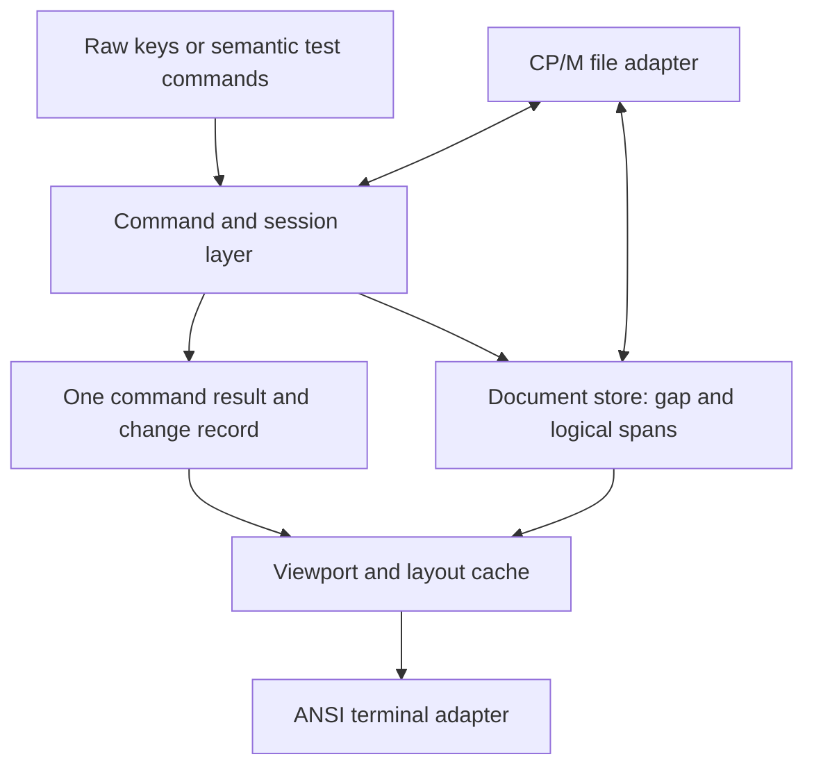

# Reusable Z80 editor engine and incremental display

Standalone Edit architecture specification — 7 September 2026

**Status:** all three milestones are complete. Milestone-three qualification finished on 8 September 2026; the completion and measurement reports retain the numerical target misses. The [three-milestone plan](../plans/editor-engine-milestones.md) governs implementation scope. This is independently maintained Edit work, separate from the two-pane manager and IDE. The active editor contract continues to govern observable behaviour until a proved, explicitly documented revision supersedes it.

## Objective and acceptance

Make sustained editing responsive near the existing 47,104-byte capacity, and make the editing behaviour reusable independently of the terminal. Retain standalone `EDIT.COM`, its file/save semantics and its current controls. Future applications may reuse the editor, but their integration is outside this project.

The selected design uses a lazily relocated gap buffer, contiguous-span traversal, a command/session layer, bounded layout caches, and incremental terminal output. These are statically linked Z80 routines with explicit state, not separate processes or a resident editor service. A gap buffer alone is insufficient: repeated full-file scanning and full-screen output must also leave the ordinary typing path.

Completion requires all of the following:

- Exact existing text, navigation, search, replacement, new-file and save behaviour, apart from the intended reduction in terminal traffic.
- The same 47,104-byte content capacity and existing memory partition, unless a separately reviewed revision explicitly changes them.
- Repeated ordinary typing at one location performs no tail-sized copies and no scan proportional to an unchanged line prefix or suffix per character, after initial layout discovery.
- Cursor-only movement with an unchanged viewport emits no text-row repaint; ordinary same-line edits with that viewport unchanged repaint at most the affected row, plus status if changed.
- Complete headless state tests, incremental/full-render equivalence, bounded memory and stack proofs, and native/browser measurements.

Sophistication belongs in clear contracts and evidence. Multiple documents, undo history, clipboard storage, syntax highlighting and a general plugin system are outside the first implementation.

## Baseline and the reason for redesign

The frozen baseline buffer shifted the suffix with `LDDR` on insertion and `LDIR` on deletion. Milestone 1 retained those shifts behind the document interface. Milestone 2 replaces them with lazy relocation inside the [document implementation](../../src/editor-document.asm). The frozen milestone-two [command path](../../test/fixtures/editor-engine-milestone2.json) still repainted 23 logical lines plus status after each command, including text far beyond the visible 80 columns. The current [presenter](../../src/editor-screen.asm) uses bounded layout caches and updates affected rows.

At a nominal 4 MHz, moving 20 KiB with repeated Z80 block transfer costs about 108 ms before other command or display work. This is a cycle-derived estimate, not measured browser latency. [Zilog instruction timing](https://www.zilog.com/docs/z80/UM0080.pdf).

Edit's [earlier buffer comparison](../../docs/reports/buffer-measurement.md) selected contiguous storage for a size-first initial release. Its gap prototype used 14 more code bytes and one more workspace byte, but traversing a complete buffer was substantially slower because of per-byte mapping. Those are historical microprototype results, not costs inherent to every gap implementation. This specification changes the selection criteria: correctness and capacity are hard limits; responsiveness requirements come next; among candidates meeting them, choose the smaller complete implementation.

The frozen baseline is Edit revision `74fc0328f35e814216031d21bf5aba715fb47232`, freshly assembled with ATOM and matched to the 3,107-byte release baseline before implementation. Older figures inside the guest specification describe earlier releases. The [measurement report](../reports/editor-engine-measurements.md) records the executable fixture, raw complete-command costs and completed 3,872-byte milestone-one artifact. The [gap report](../reports/editor-engine-gap-measurements.md) records the frozen 4,050-byte milestone-two artifact. The [implemented interface](editor-engine-interface.md) specifies the gap document, semantic commands, layout and presentation. The [milestone-three report](../reports/editor-engine-milestone3.md) records completed implementation and qualification.

## Ownership and module boundaries



| Component | Owns | Excludes |
| --- | --- | --- |
| Document store | Arena, length, gap boundaries, logical access, validated splice | Cursor policy, keys, filenames, BDOS, terminal output |
| Command/session layer | Cursor, desired visual column, committed search, dirty/edit outcomes; future selection policy | Physical addresses, ANSI sequences, file transaction internals |
| Layout/presenter | Viewport, logical-to-screen mapping, bounded caches and damage decisions | Text mutation and disk writes |
| Terminal adapter | Cursor positioning, rows, erase, attributes, bell and final cursor | Document storage and command semantics |
| CP/M application adapter | Filename, load/save transaction, prompt lifecycle, new-file state and entry/exit | A second implementation of editing behaviour |

Navigation and layout use the same tab-stop helper and document newline rules. Layout adds backward-tab reconstruction when moving an anchor left; its result must match the ordinary forward column calculation.

Edit owns production source, builds, public behaviour and independent releases. Triptych remains a separate consumer of editor releases and owns its terminal and machine integration. Tests may use host tools; production retains no Debug80 or host-runtime dependency. All new assembly and executable proofs use ATOM, with no AZM fallback.

“Headless” means that commands and document operations can execute without console or file services. It does not require dynamic loading, RPC, JSON, callbacks for every byte or multiple concurrent editor instances. The initial runtime permits one active document and one session, with synchronous, non-reentrant calls. Reuse means linking the same modules, not keeping two applications resident together.

## Document representation and invariants

Let the arena capacity be C, and its physical gap be the half-open interval `[g0,g1)`, measured from the arena base:

```text
0 <= g0 <= g1 <= C
logical length = C - (g1 - g0)
logical offset p < g0: physical offset p
logical offset p >= g0: physical offset p + (g1 - g0)
```

The logical document excludes gap bytes. The cursor is an insertion offset between zero and logical length, independently of the gap position. Navigation, search, layout and save do not relocate the gap. A mutation relocates it to the edit point if necessary. Repeated insertion there consumes the gap; deletion enlarges it.

An empty file has one gap covering the arena. A full file has a zero-length gap. Zero-length block transfers must be guarded explicitly: a zero Z80 repeat count must never become an unintended large transfer. Gap movement uses overlap-safe direction and stays inside the arena. Movement alone changes no logical bytes, cursor, dirty state or document-change record.

Load validates bytes into the arena prefix and leaves the free suffix as the gap. There is no mandatory whole-buffer move after loading. A failed initial load never enters interactive mode; this does not promise rollback to an older in-memory document because only one document is loaded per initial invocation.

The accepted text model remains printable 7-bit ASCII, tabs, LF and CRLF, ending at the first CP/M text-EOF byte or physical EOF. Preserve mixed LF/CRLF exactly. Return inserts CRLF. Public editing endpoints must not split CRLF, and deletion treats a newline as one logical character. Display columns remain 24-bit: maximum-capacity tab-only content can reach 376,832 cells, exceeding a 16-bit column.

## Core operation contract

These operation names specify semantics, not an externally released binary ABI. The [source interface](editor-engine-interface.md) records ATOM register/flag/stack contracts and parameter/state layouts. Internal implementations may use direct calls and fixed context addresses; callers must not access another component's private fields.

| Operation | Result and constraints |
| --- | --- |
| Initialise / finish validated load | Empty state or accepted content with end gap; explicit length/capacity |
| Read logical byte | Byte or explicit EOF/range result; no relocation |
| Acquire forward/backward span | Nonempty contiguous physical range and length, or explicit boundary; traversal crosses the gap without per-byte remapping |
| Replace range | Replace `[start,end)` with validated bytes; preflight complete final length and endpoint rules before mutation |
| Read logical range / stream | One or more spans in document order; no flattening required |
| Execute semantic command | Updated session plus structured outcome; no terminal or BDOS calls inside the headless path |

Acquired physical pointers are borrowed only until the next mutation or relocation. They cannot be cached in session, viewport or saved state. Logical offsets are the persistent currency. A saturating pending-change count invalidates derived state on load and unobserved mutation batches. Its values cannot wrap back to a clean cache state.

Initial insertion/replacement bytes must reside outside the text arena and remain stable for the operation. Existing small prompt/DMA storage can supply them under its established lifetime rules. Aliased self-insertion, multi-command paste and arbitrary large replacement transactions need separate contracts before addition.

Validate range, text and capacity before gap relocation or public-state mutation. Rejected edits preserve document, cursor, viewport, dirty/search and save state, except the existing status/bell behaviour. For replacement, check final length after removal, so a full document still admits equal-size replacement and deletion. Once validated, an ordinary in-memory splice has no recoverable halfway failure; implementation invariant failures are distinct from user capacity errors.

Existing literal replacement remains one replacement at the current match, with its current cursor placement and dirty semantics, including a byte-identical accepted replacement. Existing search wrap, overlap, query size and newline exclusion remain unchanged. A match may cross the physical gap; the gap is not a text boundary. Selection and undo are extension points, not newly enabled commands. Future selections use logical endpoints; future undo must declare an explicit bounded storage budget.

## Command results and layout invalidation

One fixed command-result record contains outcome, content/cursor/status flags, the old changed range, inserted byte count, and whether any newline was touched. Consumers that need the exact range use it before the next command overwrites it. Layout retains the prior viewport and cached logical positions; it does not keep a document snapshot or event queue.

The document also maintains `EditorDocumentPendingChanges`, saturating at 2. Zero means acknowledged, 1 means one accepted nonempty splice, and 2 means reset/load or multiple unacknowledged edits. Reads, rejected edits and no-ops leave that count unchanged. If the count is 1 but the last range flags have been cleared, layout rebuilds. This covers a headless edit followed by a failed or unrelated command before presentation. The generic acknowledgement clears only the count after a consumer updates or discards its derived state. It does not confirm terminal delivery or disk persistence.

The document layer reports byte changes, not screen rows. The presenter combines those changes with the old and new viewport. Conservatively invalidate from the affected row down whenever line structure changes; an unchanged net newline count does not prove unchanged layout.

For an unchanged logical anchor outside the replaced range, offsets before `start` remain unchanged, and offsets at/after old `end` shift by the signed byte-length delta. For pure insertion, anchors exactly at the insertion point require explicit left/right affinity. Cached line boundaries touching the edit are invalidated unless the operation proves their new meaning. Anchors inside removed content are invalidated or reset by command policy, never adjusted blindly.

## Incremental terminal contract

| Command effect | Required update |
| --- | --- |
| Cursor move, viewport unchanged, no selection damage | Final cursor position; changed status only |
| Same-line edit, viewport unchanged | Affected visible row, including removal of stale trailing cells |
| Newline split/join or other line-structure edit | Affected row through bottom of text viewport |
| Horizontal/vertical viewport change | Full text viewport initially |
| Search/replacement prompt change | Status/prompt row; text viewport only if its contents or position changed |
| Initial entry, return from external screen owner, lost validity | Full redraw |

The terminal adapter uses existing absolute cursor positioning, erase-line/display and SGR reset/reverse. No terminal insert/delete-character, insert/delete-line, scrolling regions, colour or box-drawing extension is required. Emit explicit positions rather than relying on delayed wrapping. Ensure bottom-right output does not accidentally scroll, restore ordinary attributes after status, and place the cursor exactly after the final update.

The implemented standalone adapter owns the whole 80-by-24 screen, with text in rows 1–23 and status in row 24. It has no rectangle parameter. Row updates use absolute positioning and erase-to-end-of-line; full updates clear the owned display and repaint status.

A parameterised rectangle remains a requirement for future embedding, not a current API. A narrower IDE view must clip every output operation and clear only its bounded remainder with spaces. It cannot reuse full-display erase or erase-to-end-of-line beyond its right edge. That future work does not require multiple simultaneous views.

`EditorPresent` consumes layout damage after a command. It repaints the complete affected row for a same-line change with an unchanged viewport. `EditorRender` remains a public force-full operation: it invalidates layout and status, restores normal rendition and clears the owned display before repainting. Prompt input invalidates status, and subsequent presentation restores the file cursor even when text rows are unchanged. Smaller character-run comparisons and a full character-and-attribute screen shadow are not implemented.

The correctness criterion is equality with a reference full renderer after every completed command: cells, attributes, cursor and bell. Intermediate ANSI byte sequences may differ. After a known external screen takeover, the caller must use `EditorRender` to discard cached screen state and repaint. Current BDOS direct console output supplies no delivery-failure acknowledgement, so invisible lost output cannot automatically invalidate the cache. A future adapter with failure reporting must request full redraw when output resumes.

Reduced guest output does not establish native or browser painting latency. Measure guest processing, terminal bytes and host display latency separately; changes to the browser renderer belong to Triptych and need their own evidence.

## Bounded layout and long lines

The implemented layout cache contains 24 two-byte boundaries: up to 23 visible line starts and the following boundary, using 48 bytes. A separate row count distinguishes a trailing empty logical line from absent screen rows. Cold discovery scans to line endings without expanding hidden tabs into cells. Once cached, a row's known content end lets painting stop at the visible edge without traversing its hidden suffix.

Each visible row has a three-byte anchor, for 69 bytes total. A normal anchor stores a logical byte offset and a phase of 0–7 columns relative to the shared cached horizontal origin. That byte's expansion covers the left edge. A second tagged form stores the exact line-end column in 19 bits; its logical end comes from the boundary table. Short and empty rows can therefore remain blank during horizontal movement without rescanning their text. The [interface](editor-engine-interface.md#layout-and-presentation-interface) defines the encoding and call order.

One same-line edit shifts later logical boundaries and offset anchors by the byte delta. The active line start has left affinity, and later end-column anchors retain their columns. An active anchor made uncertain by an edit is rediscovered. A newline change or an unobserved batch rebuilds boundaries. These cache operations do not move the document gap.

The current cursor offset and 24-bit column are cached separately. When the cursor changes, ordinary local column lookup can scan forward from its row's near-left anchor. This also handles Backspace without requiring the deleted byte to remain available. Cache misses and distant jumps use the original navigation scan. Persistent cache fields are separate from prompt, save and rendering scratch, so those operations cannot silently overwrite them.

Horizontal following is unchanged: after column 79, the origin advances just enough to keep the cursor visible. Ordinary right-edge typing can therefore repaint all 23 text rows on every key. Before publishing a changed horizontal origin, layout adjusts every row anchor. Rightward adjustment examines newly crossed bytes; leftward movement over printable bytes decrements a known column. Short rows use their exact end-column tags. Full output during these shifts remains a separate cost from bounded text inspection.

Crossing a tab backwards may scan the preceding printable run to recover the tab's starting column modulo eight. Cold discovery, distant jumps and this backward-tab case can inspect a long prefix. They remain explicit costs in the measurement contract. Warm ordinary typing must avoid repeatedly rescanning an unchanged long prefix or suffix; that requirement does not make every navigation operation constant-time.

## Load/save and application integration

The [milestone 1 migration audit](editor-engine-interface.md#migration-audit) accounts for every direct arena access. Load uses a privileged document builder, replacement uses validated splice, and saving uses logical spans/range copy. Navigation uses cached line/column lookup with raw-scan fallback, and row painting retains logical byte access over the clipped region. The document implementation is the sole production owner of physical arena arithmetic and length writes.

Save iterates spans without moving the gap or flattening the document. Whole 128-byte logical records wholly within one span may be written directly where the adapter contract permits. A record crossing the gap is assembled in the existing DMA buffer. Only the final partial record is padded with CP/M EOF bytes; empty and exact-record-length content emits no extra record.

Preserve existing temporary/backup collision checks, close checks, installation, rollback, retry, new-file handling and incoming-stack restoration. A save failure leaves editable text and gap location intact. “Saved” retains its current CP/M meaning; this redesign does not add a browser-durability guarantee or change host checkpoint acknowledgement.

Standalone Edit retains its current key decoding, status and prompt behaviour. Semantic tests call the same command routines directly. The future manager can provide logical file/cursor/viewport state through a versioned handoff; no physical gap pointer or cache is serialised. Revalidate positions after loading and clamp them to legal character boundaries.

Tool return remains a separate integration contract. A reusable core does not make arbitrary COM children return to a resident parent. Any future consumer must qualify its own tool-loading and return behaviour. The engine must not require manager residency, a replacement CCP, or a privileged host file interface.

## Memory budget and performance gates

The initial hard partition remains code/immutable data below 1E00, 512 bytes of workspace at 1E00, the 47,104-byte arena at 2000, and the existing private stack below E400. No scratch cache may silently consume text capacity or move into unaccounted stack/DMA storage. The declared private stack capacity is not permission to reclaim it without a separate liveness proof.

Workspace accounting progresses from 297 bytes in the original baseline to 338 in milestone 1 and 342 in milestone 2. The integrated milestone-three allocation is 490 of 512 bytes:

| Account | Bytes |
| --- | ---: |
| Original workspace, including the length word | 297 |
| Document requests/results/scratch, gap bounds and pending count | 38 |
| Semantic session request/result state | 8 |
| Layout boundaries and tagged anchors | 117 |
| Persistent layout cursor/origin/validity state | 13 |
| Layout scratch | 12 |
| Presenter status and row-loop state | 5 |
| **Total** | **490** |

The remaining 22 bytes are unallocated. Tagged anchors replace the earlier estimate of five bytes per row; they retain the information needed at the viewport edge in three bytes. No screen buffer, row staging buffer or whole-file line index is allocated. Code size and stack high-water measurements must be taken from the exact qualified build; fitting workspace alone does not establish responsiveness.

Performance acceptance combines structural requirements with proposed numerical budgets:

| Workload | Gate |
| --- | --- |
| Warm burst of 100 ordinary insertions at one location, capacity permitting | Zero gap-relocation bytes after the first insertion; no repeated scan of an unchanged long line prefix/suffix, including right-edge typing |
| Cursor-only movement inside unchanged viewport | Zero text-row repaint bytes |
| Ordinary same-line insertion, viewport unchanged | At most one text-row repaint; status only when changed |
| Warm ordinary edit on representative source, including row output | Target at most 100,000 guest T-states per command, equivalent to 25 ms at nominal 4 MHz |
| Input-to-visible update in native and browser sessions | Proposed p95 target below 50 ms for sustained ordinary typing; report actual scheduling/environment |
| Distant jump followed by first edit | Count relocation and scan costs explicitly; report worst case separately from warm typing |
| Load/save/search/full redraw | Compare complete old/new paths; investigate regressions rather than concealing them in typing averages |

The numerical budgets are proposed acceptance targets, not achieved measurements or guarantees for every pathological line. If complete implementation cannot meet them within the hard memory/behaviour limits, report the failing account and revise the design explicitly. Do not silently lower text capacity or average away a large first-edit delay.

Measure empty, ordinary source, 16 KiB, 40 KiB and near-capacity documents; start/middle/end edits; large jumps; a giant printable line; tab-heavy lines; LF-only content; split/join; search across gap; and save crossing gap. Count document bytes copied and inspected, guest T-states, terminal bytes, BDOS calls and host wall latency separately. Use deterministic instruction counts and at least 30 repeated host samples after warm-up, reporting median and p95. Retain raw samples, exact artifact identity and workload inputs. No native/browser measurement establishes physical hardware behaviour.

## Implementation sequence

1. **Freeze current behaviour and ruler.** Assemble current Edit with ATOM, record exact partitions/artifact identity, and run baseline workloads through its real entry/command paths. Retain state/terminal/disk fixtures. Include the earlier gap prototype only as historical design evidence; no AZM execution.
2. **Introduce document and command boundaries with contiguous storage.** Replace direct arena dependencies with logical operations and span traversal. Keep full rendering. Existing behavioural proofs must pass; new command outcomes must be correct before they drive damage decisions.
3. **Implement the gap behind the same interface.** Prove invariants, rejection atomicity, forward/backward spans, mixed newline behaviour, search and save across the gap. Compare first-edit relocation separately from subsequent edits. Keep the fixed memory/capacity limits.
4. **Introduce incremental output.** Retain a development-only reference full renderer. Compare terminal state after each command; begin with cursor-only, one-row, suffix and full invalidation. No terminal capability expansion.
5. **Remove repeated layout scans.** Add the bounded boundary cache and measured current-line/column anchors. Prove invalidation across edits, horizontal scrolling, tabs, EOF, reset and saturated batches. Meet the sustained typing gates.
6. **Qualify standalone Edit.** Run the owner's complete checks and native/browser CP/M integration using immutable release candidates, including smallest applicable TPA profiles and all exit/save-failure paths. Publish through Edit's existing independent release process only under separate release authorisation.
The three-milestone plan groups these steps into measured boundary extraction, gap storage, and incremental display. IDE handoff, downstream pin updates and release publication are outside the active work.

Milestone 3 implementation, technical documentation and qualification are complete. Release publication, downstream integration and a parameterised IDE view remain excluded.

## Required correctness evidence

Use a simple independent logical-byte model for generated edit sequences. Compare contents, cursor, dirty/search state and expected outcomes after every operation. This model need not use a gap. Exercise every gap position around CRLF, tabs, start/end, zero gap and capacity boundaries; forward and backward spans; input aliases rejected before writes; and full-buffer equal-length replacement.

Terminal differential tests cover split/join on the top and bottom rows, shrinking lines, tab expansion, horizontal scroll, empty/trailing-newline files, prompt cancellation, failed commands, restored viewport, repeated search and attribute reset. Cache tests must compare against uncached scans and count bytes inspected so a fast host cannot hide quadratic work.

Disk tests cover every record alignment relative to the gap, exact and partial final records, EOF conventions, collisions, each save failure/rollback phase, successful retry and unchanged logical content. Guard every workspace/text/stack interval and inspect the exact incoming SP/return PC. Prove any DMA or scratch lifetime sharing on every error path.

## Design selection and deferred alternatives

Two independent candidates compared a combined document/command core with a smaller mutation core plus session layer. Both converged on a private gap store, separate semantic commands, span traversal and viewport damage outside the document. The selected shape names the document store and session separately while treating both as the reusable headless engine. This prevents filename/save policy and terminal status from entering the storage API.

Selection criteria were fixed capacity/memory, preserved semantics, sustained typing and long-line costs, a small reusable interface, incremental ownership-safe migration, and measurable acceptance. The bounded 24-boundary cache and explicit cold-versus-warm workloads came from the command-core candidate. The storage/session candidate supplied the rectangle-clipping requirement for future embedding. Its optional 80-byte staging row is deferred: direct span-to-terminal output leaves more workspace for measured layout needs. The direct-access migration audit and separation of document edits from screen damage were independently supported by both candidates. Independent cross-review accepted the architecture and identified rectangle ownership, warm long-line rescanning during horizontal scrolling, and the absence of delivery-failure reporting in current console output. Those corrections are incorporated above. The implemented three-byte tagged anchors fit the fixed workspace; performance qualification remains a separate gate.

Rejected initial designs are a gap tied to cursor navigation, per-byte remapping for every scan, a full-file line index, a rope/piece table without evidence of benefit at this capacity, a full screen shadow, and a message-based editor service. They add avoidable movement, metadata, mapping or runtime costs. None is categorically unsuitable for all editors; none is necessary for this one-document Z80 target.

Modern precedents establish the separation rather than a portable Z80 implementation: [CodeMirror's state/view model](https://codemirror.net/docs/guide/), [Neovim's external UI interface](https://neovim.io/doc/user/api-ui-events/), and [Scintilla's reusable editing component](https://www.scintilla.org/ScintillaDoc.html). This plan adopts the principle without importing their runtime, document model or platform assumptions.

The baseline measurement and contiguous-storage migration are recorded in the [milestone 1 completion report](../reports/editor-engine-milestone1.md). Milestone 2 implements gap storage behind that interface and compares complete commands against both frozen earlier binaries. Its measurements separate local typing gains from mapping and traversal regressions. The integrated milestone-three implementation adds incremental presentation and bounded caches. Its completion depends on the required correctness and measurement evidence, including explicit reporting of unmet timing targets or unavailable host measurements.
